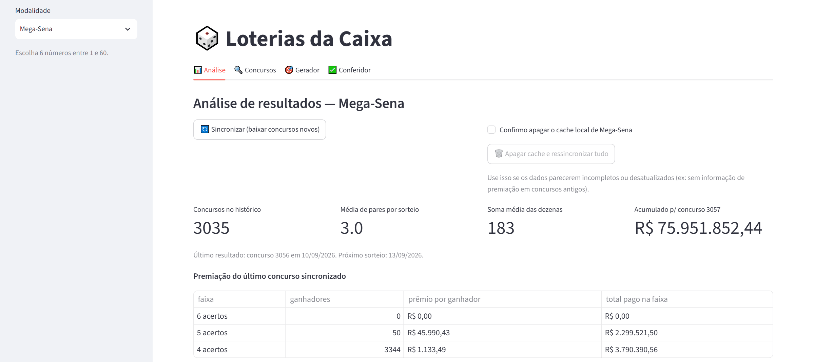
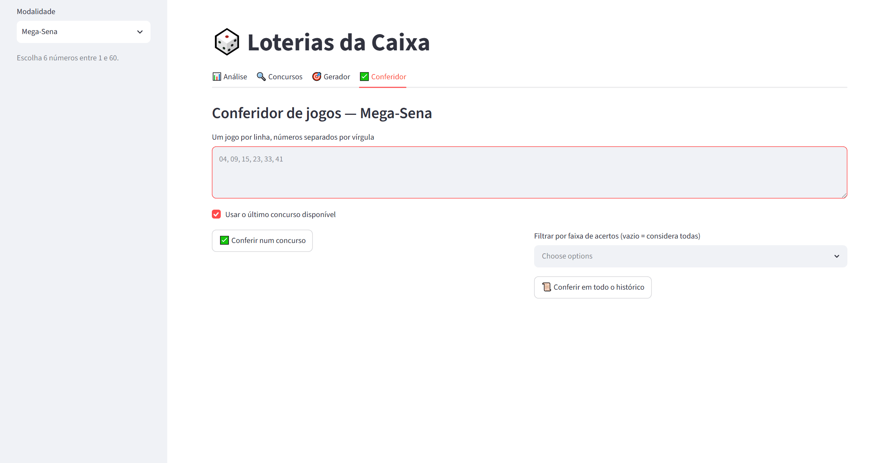
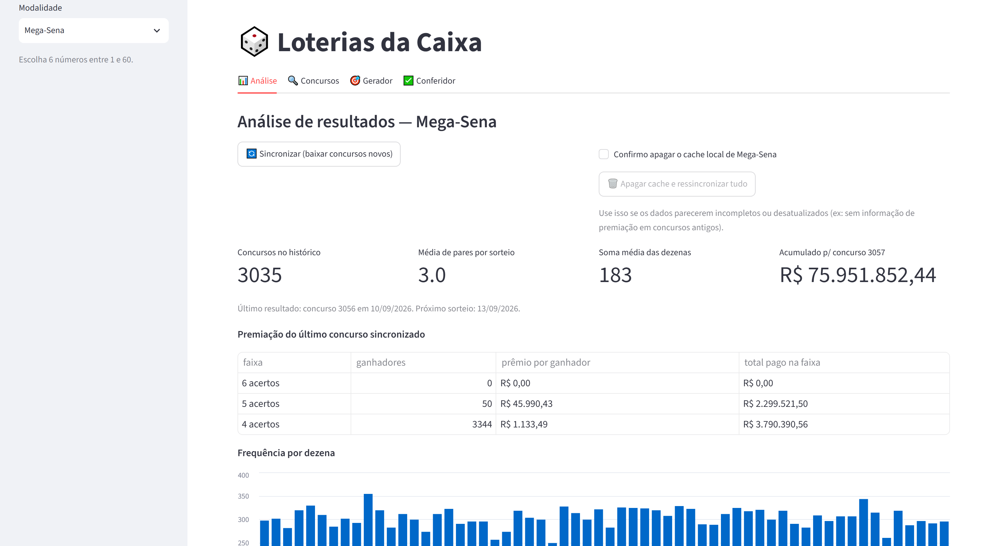
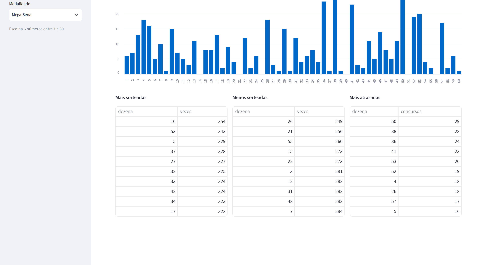
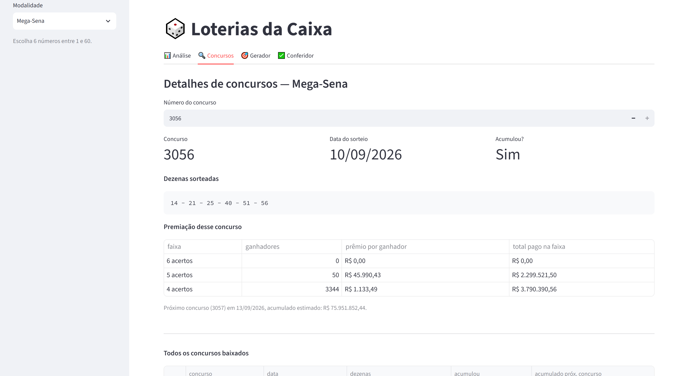
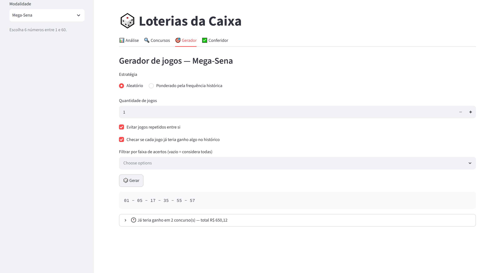
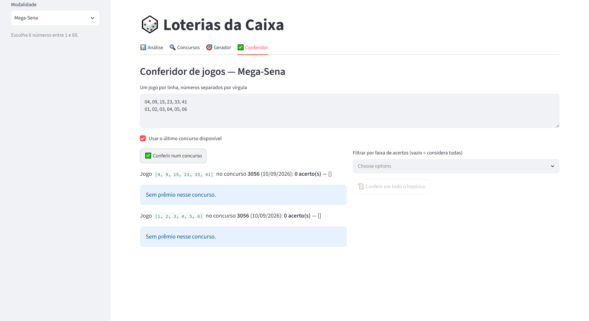

<div align="center">


# 🎲 Loterias da Caixa

**Um sistema local de análise, geração e conferência de jogos das loterias da Caixa — API pública, sincronização paralela resiliente, e décadas de "quero saber se eu já teria ganhado" transformadas em dado inspecionável.**

[](https://www.python.org/)
[](https://streamlit.io/)
[](https://pandas.pydata.org/)
[](https://www.sqlite.org/)
[](https://pyinstaller.org/)
[](https://pywebview.flowrl.com/)
[](LICENSE)

[English](README.md) · **Português (BR)**

### [⬇️ Baixar para Windows](https://github.com/merino626/lottery-analyzer/releases/download/v1.0.0/LotteryAnalyzer-Setup-1.0.0.zip)

<sub>Versão 1.0.0 · Windows 10/11 (x64) · zip de ~185 MB · [todas as versões](https://github.com/merino626/lottery-analyzer/releases/latest)</sub>

</div>

---

## Sumário

- [Download](#download)
- [Sobre as modalidades suportadas](#sobre-as-modalidades-suportadas)
- [Screenshots](#screenshots)
- [Por que eu fiz isso](#por-que-eu-fiz-isso)
- [O que o sistema faz](#o-que-o-sistema-faz)
- [Funcionalidades](#funcionalidades)
- [Stack técnica](#stack-técnica)
- [Arquitetura](#arquitetura)
- [Decisões de engenharia que valem a pena destacar](#decisões-de-engenharia-que-valem-a-pena-destacar)
- [Executável para Windows](#executável-para-windows)
- [Estrutura do projeto](#estrutura-do-projeto)
- [Rodando localmente](#rodando-localmente)
- [Aviso legal](#aviso-legal)
- [Roadmap](#roadmap)
- [Licença](#licença)

---

## Download

| Plataforma | Arquivo | Baixar |
|---|---|---|
| **Windows 10/11 (x64)** | `LotteryAnalyzer-Setup-1.0.0.zip` — ~185 MB | **[⬇️ Download direto](https://github.com/merino626/lottery-analyzer/releases/download/v1.0.0/LotteryAnalyzer-Setup-1.0.0.zip)** |
| macOS / Linux | Ainda não empacotado | [Compile você mesmo](#executável-para-windows) |

Notas da versão: **[v1.0.0](https://github.com/merino626/lottery-analyzer/releases/tag/v1.0.0)** · todas as versões: [página de releases](https://github.com/merino626/lottery-analyzer/releases/latest)

Descompacte em qualquer lugar e rode o `LoteriasDaCaixa.exe` dentro da pasta extraída — sem instalador, sem precisar de permissão de administrador, nada é gravado fora de `%APPDATA%\LoteriasDaCaixa\` (veja [o que esperar ao rodar](#executável-para-windows)). É uma pasta, não um arquivo único, por causa de como o app se empacota — [explicado abaixo](#executável-para-windows).

> O `.exe` não é assinado digitalmente (certificado de assinatura de código é pago), então o SmartScreen do Windows provavelmente vai mostrar um aviso de **"O Windows protegeu o computador"** na primeira execução. Clique em **Mais informações → Executar assim mesmo**, ou compile a partir do código-fonte com os comandos em [Executável para Windows](#executável-para-windows) pra saber exatamente o que tem dentro.

---

## Sobre as modalidades suportadas

O projeto sincroniza o histórico completo de sorteios direto do serviço público de resultados da Caixa e dá a esses dados uma interface de verdade — análise, gerador e conferidor — para as **oito** modalidades:

| Modalidade | Escolhe | Faixa | Particularidade |
|---|---|---|---|
| **Mega-Sena** | 6 números | 1–60 | A carro-chefe — prêmios milionários, dois sorteios por semana |
| **Lotofácil** | 15 números | 1–25 | Odds bem melhores, prêmios menores e mais frequentes |
| **Quina** | 5 números | 1–80 | Sorteio diário |
| **Lotomania** | 50 números | 0–99 | A modalidade com mais números escolhidos por jogo |
| **Dupla-Sena** | 6 números | 1–50 | Dois sorteios por concurso — duas chances com um único jogo |
| **Timemania** | 10 números | 1–80 | Escolhe também um "Time do Coração" — parte da arrecadação vai para clubes de futebol |
| **+Milionária** | 6 números + 2 trevos | 1–50 + 1–6 | Escolha extra de dois "trevos" (1–6), com piso de prêmio garantido |
| **Dia de Sorte** | 7 números | 1–31 | Mais a escolha de um "Mês da Sorte" |

**Nenhuma aposta real acontece dentro do app** — veja o [aviso legal](#aviso-legal).

---

## Screenshots

### Trocar de modalidade refaz todos os gráficos na hora

Frequência, atraso e o último acumulado são recalculados ao vivo — a distribuição de 60 números da Mega-Sena não se parece em nada com a de 25 da Lotofácil.



### Conferir um jogo contra mais de 3.000 concursos em cerca de um segundo

Não só "isso teria batido a sena" — toda faixa de premiação que o jogo teria acertado, em todo concurso já sincronizado, somado num total.



### Análise — o retrato completo de uma modalidade

|                                          Visão geral                                          |                                        Frequência, atraso e rankings                                        |
| :----------------------------------------------------------------------------------------------: | :------------------------------------------------------------------------------------------: |
| <br>_Total de concursos, último acumulado e a premiação do concurso mais recente sincronizado_ | <br>_Há quantos concursos cada dezena não sai, mais os rankings de mais/menos sorteadas_ |

### Concursos — qualquer concurso já baixado, em detalhe


_Dezenas sorteadas, premiação por faixa, e todo o histórico local numa tabela só._

### Gerador — aleatório ou ponderado pela frequência, já conferido na hora


_Gera um jogo e já mostra se ele já teria ganho algo no histórico local, e quanto._

### Conferidor — contra um concurso ou contra todo o histórico local


_Cole um ou mais jogos, um por linha; confira contra o último concurso, um específico, ou tudo que já foi baixado._

_Todas as capturas acima são do app de verdade, com dados reais sincronizados publicamente — nenhum dado fictício._

---

## Por que eu fiz isso

Conferir os números da semana passada e ficar imaginando "eu já teria ganho alguma vez com esse jogo?" é um hábito extremamente comum por aqui, e eu quis transformar essa curiosidade em algo que eu pudesse realmente investigar: a dezena 10 sai mesmo mais na Mega-Sena, ou é só impressão? Qual a chance real de um jogo simples de 6 números já ter batido *alguma* faixa de premiação em mais de 3.000 concursos?

Também é uma vitrine pequena e completa de algumas decisões que não aparecem num CRUD comum:

- um motor de sincronização que trata "o que falta" como **diferença de conjuntos**, não "um número maior que o último salvo" — se recupera sozinho de buracos deixados por uma API pública instável, em vez de só correr atrás do concurso mais recente;
- degradação graciosa e deliberada sob limite de requisições, em vez de insistir contra um servidor que já pediu pra desacelerar;
- uma regra de correspondência que prefere responder "não sei" a arriscar atribuir o valor errado de premiação; e
- um único código-fonte que roda igual como servidor local (`streamlit run app.py`) e como **.exe clicável no Windows**, com uma única diferença bem isolada entre os dois: onde o arquivo de cache fica salvo.

E, sendo direto sobre isso — do jeito que o [aviso legal](#aviso-legal) também é — frequência de dezenas num sorteio justo **não prevê** sorteios futuros. Frequência histórica e "há quantos concursos uma dezena não sai" são estatísticas reais e honestamente calculadas sobre o passado; nada aqui alega prever o futuro. O modo "ponderado pela frequência" do gerador existe porque é uma estratégia popular que as pessoas realmente usam, não porque haja qualquer evidência de que ela supera escolher números aleatoriamente — cada sorteio é independente do anterior.

---

## O que o sistema faz

O app abre como uma página Streamlit local com **quatro abas**, todas relativas à modalidade escolhida no menu lateral:

1. **Análise** — sincroniza o histórico completo da modalidade escolhida a partir da API pública da Caixa para um cache local em SQLite (download paralelo, retomável), e mostra frequência e "atraso" (concursos desde a última vez que saiu) por dezena, rankings de mais/menos sorteadas, e a premiação completa do último concurso sincronizado mais o acumulado do próximo.
2. **Concursos** — consulte qualquer concurso já baixado: dezenas sorteadas, data, se acumulou, e a tabela completa de premiação por faixa, com o valor exato pago a cada ganhador.
3. **Gerador** — gera um ou vários jogos, aleatórios ou ponderados pela frequência histórica, e opcionalmente mostra na hora quantas vezes aquele jogo exato já teria ganho *algo* no histórico sincronizado, e quanto, com filtro para restringir a faixas específicas.
4. **Conferidor** — cole um ou mais jogos e confira contra um concurso específico (ou o mais recente) ou contra **todo o histórico sincronizado de uma vez**, listando cada concurso em que o jogo teria batido alguma faixa, qual faixa, o valor, e o total acumulado.

---

## Funcionalidades

### 🔄 Motor de sincronização
- Baixa os concursos faltantes em paralelo (5 requisições simultâneas por padrão) via `ThreadPoolExecutor` — uma modalidade com milhares de concursos, como Quina ou Lotofácil, demoraria demais uma requisição de cada vez.
- "O que falta" é calculado como **o conjunto completo de concursos menos o que já está em cache**, não apenas "qualquer coisa depois do maior concurso salvo" — então uma sincronização interrompida no meio (deixando buracos no meio do histórico) é corrigida corretamente na próxima execução, não só estendida no fim.
- Se a API da Caixa começar a responder `429`/`403` (limite de requisições) repetidamente, a sincronização **para sozinha** depois de uma sequência de falhas seguidas em vez de insistir por minutos — o que já foi baixado fica salvo, e a próxima sincronização retoma exatamente de onde parou.
- Cada requisição tenta de novo com backoff exponencial mais jitter antes de contar como falha.

### 📊 Análise
- Frequência e "atraso" (há quantos concursos não sai) por dezena, sobre todo o histórico local.
- Rankings de mais sorteadas, menos sorteadas e mais atrasadas.
- Proporção de pares/ímpares e soma média por sorteio.
- Premiação completa do último concurso sincronizado — ganhadores e valor por faixa — mais o acumulado e a data do próximo concurso.

### 🎯 Gerador
- Duas estratégias: aleatório uniforme, ou amostragem ponderada **sem reposição** pela frequência histórica (um sorteio ponderado de verdade, não "sortear com reposição e torcer para não repetir").
- Opção de evitar jogos repetidos dentro do mesmo lote gerado.
- Checagem instantânea opcional de cada jogo gerado contra todo o histórico local, com filtro de faixa.

### ✅ Conferidor
- Confira quantos jogos quiser, um por linha, contra um concurso específico ou contra todo o histórico local de uma vez.
- Bate contra **qualquer** faixa de premiação correspondente à quantidade de acertos — não só a faixa principal — então um jogo de Mega-Sena com 4 acertos é corretamente reportado, mesmo a "faixa principal" sendo 6 acertos.
- O modo histórico lista todo concurso em que o jogo teria ganho algo, a faixa, o valor, e o total somado.

### 🖥️ Roda de duas formas a partir do mesmo código
- Como app web local: `streamlit run app.py`.
- Como **.exe** standalone para Windows — veja [abaixo](#executável-para-windows) — sem precisar instalar Python.

---

## Stack técnica

| | |
|---|---|
| **Streamlit** | Toda a interface — menu lateral, abas, gráficos, tabelas, formulários — sem build de frontend separado. |
| **Pandas** | Molda os resultados de consulta nas tabelas e gráficos de barra que o Streamlit renderiza. |
| **SQLite** (`sqlite3` da stdlib) | Cache local de todo concurso sincronizado — um arquivo só, zero configuração, portátil. |
| **Requests** | Conversa com a API pública (não-oficial) de resultados da Caixa, com retry/backoff por cima. |
| **`concurrent.futures.ThreadPoolExecutor`** (stdlib) | Paraleliza o download dos concursos faltantes — é trabalho de I/O (HTTP), então threads são a ferramenta certa, sem precisar reescrever em async. |
| **PyInstaller** | Empacota o app mais um pequeno launcher num `.exe` standalone para Windows. |
| **pywebview** | Embute a interface numa janela nativa de verdade (o WebView2/Edge Chromium do próprio Windows) no build desktop — sem navegador visível, sem console. |

Sem framework web adicional, sem ORM, sem fila de tarefas — um app de análise de dados como esse não precisa disso, e o próprio servidor do Streamlit já é todo o backend.

---

## Arquitetura

```
                           NAVEGADOR (localhost)
                                     │
                          ┌──────────▼───────────┐
                          │        app.py         │   4 abas, 1 menu lateral (escolha da modalidade)
                          └──────────┬───────────┘
                                     │
        ┌───────────────┬───────────┼───────────────┬────────────────┐
        ▼                ▼           ▼               ▼                │
   analysis.py     generator.py  checker.py       sync.py              │
   frequência,      aleatório /   confere jogo    download paralelo,   │
   atraso, ranks    ponderado     vs. 1 ou todos   retomada por        │
        │                │       concursos          buraco             │
        └────────────────┴─────────────┬─────────────┘                │
                                        ▼                               │
                                 storage.py (SQLite)                    │
                                        │                               │
                        data/resultados.db, ou                         │
                %APPDATA%/LoteriasDaCaixa/ quando empacotado ◄─────────┘
                                        ▲
                                        │ HTTP, retry + backoff (api.py)
                                        │
                       API pública de resultados da Caixa
```

Todo módulo fala com `storage.py`, nunca com `api.py` e `storage.py` ao mesmo tempo — `sync.py` é o único lugar que escreve resultados novos da API no cache; todo o resto (`analysis`, `generator`, `checker`) só lê do SQLite. Essa separação é o que torna possível "sincronizar uma vez, analisar/gerar/conferir instantaneamente e offline depois".

---

## Decisões de engenharia que valem a pena destacar

**Sincronização ciente de buracos, não só "retoma do último salvo."** `_concursos_faltantes` calcula `{1 .. mais_recente} - {já em cache}` como uma diferença de conjuntos de verdade, toda vez. A API da Caixa às vezes começa a recusar requisições no meio de uma sincronização, o que pode deixar buracos no *meio* do histórico mesmo com o concurso mais recente já salvo primeiro. Retomar apenas do "maior concurso salvo" deixaria esses buracos passar para sempre; a diferença de conjuntos encontra e preenche exatamente eles na sincronização seguinte.

**A sincronização desiste de propósito.** Depois de `FALHAS_SEGUIDAS_LIMITE` (8) requisições seguidas com falha — a assinatura de uma API limitando a taxa do cliente — a sincronização levanta `SincronizacaoParcial` em vez de continuar tentando por minutos. Tudo que foi baixado até ali já está salvo; o usuário é avisado claramente do que aconteceu e de que rodar de novo mais tarde retoma corretamente. Insistir contra um servidor que já pediu para desacelerar não ajuda ninguém.

**Uma regex que se recusa a casar de propósito.** `_PADRAO_ACERTOS` só casa descrições de prêmio "puras" tipo `"6 acertos"` — nunca `"6 acertos + 2 trevos"` (a faixa bônus de dois trevos da +Milionária). Duas faixas de premiação diferentes podem ter a mesma contagem de acertos mas diferir por um critério extra (um "trevo" ou um "Time do Coração") que este app não rastreia. Casar de forma solta ali teria atribuído silenciosamente o valor da faixa errada a um jogo. Reportar "acertos = None" (não rastreado) para essa faixa foi a escolha deliberadamente menos conveniente, porém correta.

**Conferência por todas as faixas, não só a principal.** `conferir_no_historico` confere a contagem de acertos de um jogo contra *toda* faixa de premiação paga naquele concurso, não só a faixa principal daquela modalidade. Um jogo de Mega-Sena com 4 acertos é uma faixa de premiação real e paga — um conferidor que só reportasse "sena ou nada" diria a um jogo premiado que ele perdeu.

**Amostragem ponderada sem reposição, feita direito.** A estratégia do gerador ponderada por frequência (`_amostra_ponderada_sem_reposicao`) renormaliza os pesos restantes e sorteia de novo a cada escolha, em vez do atalho mais fácil — porém estatisticamente errado — de amostrar com reposição e descartar repetidos (o que distorce a ponderação efetiva, especialmente quando `k` se aproxima do tamanho da população, como acontece nos 50-de-100 da Lotomania).

**Um código, dois ambientes de execução.** `storage.DB_PATH` resolve de forma diferente dependendo de `sys.frozen`: um `data/resultados.db` normal ao lado do projeto quando rodado com `streamlit run app.py`, ou um `%APPDATA%/LoteriasDaCaixa/resultados.db` persistente quando rodando como o `.exe` empacotado. Essa diferença existe por um motivo concreto: o modo `--onefile` do PyInstaller extrai o app inteiro para uma **pasta temporária apagada quando o processo termina** — sem essa separação, o `.exe` baixaria o cache inteiro do zero silenciosamente a cada execução.

**Uma janela nativa e um servidor em background não cabem na mesma thread principal — então não cabem no mesmo processo.** O build desktop embute a interface numa janela real via `pywebview` (o motor WebView2/Edge Chromium do próprio Windows), e o loop de eventos do pywebview precisa ser dono da thread principal. O bootstrap do próprio Streamlit *também* insiste na thread principal — ele registra um handler de `SIGTERM` ao subir, algo que o Python só permite ali. Rodar o Streamlit numa thread separada levanta `ValueError: signal only works in main thread of the main interpreter`. A solução: `desktop_launcher.py` reexecuta a si mesmo como um **subprocesso** com uma flag oculta; a thread principal do processo pai roda a janela, a thread principal do processo filho roda o Streamlit — cada um ganha a thread principal que exige, porque cada um é um processo diferente.

**Um servidor órfão, resolvido com um Job Object do Windows.** Dividir o app em dois processos cria um problema de limpeza: o que para o subprocesso do Streamlit se o processo da janela for morto diretamente (crash, Gerenciador de Tarefas, um desligamento forçado) em vez de fechado normalmente? Um `finally: processo.terminate()` nunca roda nesse caso — é código Python, e um processo morto não tem chance de rodar sua própria limpeza. A solução real fica um nível abaixo do Python: o processo filho é atribuído a um *Job Object* do Windows criado com `JOB_OBJECT_LIMIT_KILL_ON_JOB_CLOSE`, de forma que o próprio kernel do sistema garante que o filho morre no instante em que o handle do pai para aquele job desaparece — inclusive num kill forçado que o pai nunca viu chegar. Verificado matando o processo pai à força no meio de uma sessão e confirmando que o servidor e seus processos auxiliares do WebView2 desaparecem juntos, em vez de ficarem rodando escondidos em segundo plano.

**Latin-1, não UTF-8.** A API da Caixa envia texto acentuado (em português, claro) codificado em latin-1 sem declarar nada confiável nos headers; decodificar como UTF-8 por padrão corrompe todo caractere acentuado nas descrições de prêmio e datas. `api.py` define `resposta.encoding = "latin-1"` explicitamente antes de interpretar o corpo JSON.

**Migração de schema aditiva e idempotente.** `storage._migrar` inspeciona `PRAGMA table_info` e adiciona qualquer uma das três colunas (adicionadas depois do schema original) que estiver faltando, tolerando um arquivo de cache criado por uma versão mais antiga do app em vez de forçar um apagão.

---

## Executável para Windows

O mesmo código também vira um app desktop de verdade — sem precisar instalar Python, sem terminal, sem precisar achar uma aba de navegador: clica duas vezes em `LoteriasDaCaixa.exe` e abre uma janela de verdade, com o app já rodando dentro dela.

### Como funciona

[`desktop_launcher.py`](desktop_launcher.py) é o ponto de entrada que o PyInstaller empacota. Ao abrir, ele:

1. escolhe uma porta local livre e reexecuta a si mesmo como um **subprocesso**, passando uma flag oculta que diz pra essa cópia só rodar `streamlit run app.py` naquela porta (veja [por que um subprocesso e não uma thread](#decisões-de-engenharia-que-valem-a-pena-destacar) acima);
2. espera a porta responder, depois abre uma janela nativa de verdade via **`pywebview`** (o motor WebView2/Edge Chromium que já vem com o Windows) apontando direto pra ela — sem barra de endereço, sem moldura de navegador, sem aba separada;
3. se o WebView2 não estiver disponível por algum motivo, cai de volta para abrir no navegador padrão do sistema em vez de simplesmente falhar;
4. amarra o subprocesso do Streamlit a um Job Object do Windows, para que ele nunca sobreviva à janela, mesmo se o app for fechado à força.

O resultado se comporta como um app desktop comum: um processo na barra de tarefas, uma janela, nenhum console.

### Compile você mesmo

```bash
pip install -r requirements.txt -r requirements-desktop.txt
python build_exe.py
```

Isso gera `dist/LoteriasDaCaixa/` — uma **pasta**, não um arquivo único (modo `--onedir` do PyInstaller: abre mais rápido que `--onefile`, e esse app em particular sobe uma segunda cópia de si mesmo como subprocesso a cada execução, o que com onefile significaria extrair o pacote inteiro duas vezes). O `LoteriasDaCaixa.exe` dentro dessa pasta é o que você realmente executa; para compartilhar, zipe a pasta inteira. Nada dentro de `dist/`/`build/` fica versionado — `build_exe.py` regenera tudo do zero sempre, usando [`assets/icon.ico`](assets/icon.ico) como ícone do executável.

> O `.exe` não é assinado digitalmente (certificado de assinatura de código é pago), então o SmartScreen do Windows provavelmente vai mostrar um aviso de **"O Windows protegeu o computador"** na primeira execução. Clique em **Mais informações → Executar assim mesmo**, ou compile você mesmo a partir do código-fonte com os comandos acima para saber exatamente o que tem dentro.

### O que esperar ao rodar

- O WebView2 já vem instalado por padrão no Windows 10 (21H2+) e Windows 11, então normalmente isso simplesmente funciona; numa instalação mais antiga ou enxuta sem ele, o app abre no navegador padrão em vez de falhar (ver passo 3 acima).
- Os dados sincronizados persistem entre execuções em `%APPDATA%\LoteriasDaCaixa\resultados.db` (veja a seção de [arquitetura](#arquitetura) acima para entender por que isso difere do caminho usado em modo desenvolvimento) — apagar essa pasta reseta o cache exatamente como o botão "apagar e ressincronizar" dentro do app.

---

## Estrutura do projeto

```
loterias/
├── app.py                    # interface Streamlit — menu lateral + as 4 abas, sem regra de negócio
├── desktop_launcher.py       # ponto de entrada do .exe (split em subprocesso + janela nativa via pywebview)
├── build_exe.py              # build reprodutível via PyInstaller (`python build_exe.py`)
├── requirements.txt          # para rodar o app: `streamlit run app.py`
├── requirements-desktop.txt  # dependências extras só pra empacotar o .exe (pyinstaller, pywebview)
│
├── loteria/                  # toda a regra de negócio — importável e testável isoladamente
│   ├── api.py                 # cliente HTTP da API pública da Caixa: retry/backoff, latin-1, parsing da resposta
│   ├── modalidades.py         # configuração estática das 8 modalidades (faixas, qtd. de números, slug da API)
│   ├── sync.py                 # sincronização paralela, ciente de buracos e de limite de requisições, para SQLite
│   ├── storage.py              # persistência SQLite + migração de schema; resolve o caminho do banco (dev vs. .exe)
│   ├── analysis.py             # frequência, atraso, rankings, estatísticas de par/ímpar/soma
│   ├── generator.py             # geração de jogos aleatórios / ponderados pela frequência
│   └── checker.py               # confere um jogo contra um concurso ou todo o histórico, qualquer faixa
│
├── assets/
│   ├── icon.ico                 # ícone do .exe no Windows
│   └── icon.png                 # mesmo ícone, usado neste README
│
├── docs/screenshots/            # tudo que está incorporado acima neste README
│
└── data/                        # cache local em SQLite — criado automaticamente, não versionado (ver .gitignore)
```

---

## Rodando localmente

### Pré-requisitos

- Python 3.11+ (desenvolvido e testado nessa versão; outras versões 3.x provavelmente funcionam também)

### Instalação

```bash
git clone https://github.com/merino626/lottery-analyzer.git
cd lottery-analyzer
pip install -r requirements.txt
```

### Executar

```bash
streamlit run app.py
```

Abre automaticamente em `http://localhost:8501`. Escolha uma modalidade no menu lateral, clique em **Sincronizar** na aba Análise para baixar o histórico (pode demorar um pouco na primeira vez para as modalidades maiores — só a Quina já tem mais de 7.000 concursos), e as outras três abas passam a funcionar a partir desse cache local.

---

## Aviso legal

Este é um projeto de hobby independente e não-oficial, **sem qualquer afiliação, endosso ou vínculo** com a Caixa Econômica Federal. Ele lê resultados de concursos publicamente disponíveis a partir do próprio serviço de resultados da Caixa, apenas para fins de análise histórica; não usa nenhuma API privada ou autenticada.

**Nenhuma aposta real, transferência de dinheiro ou qualquer forma de jogo por dinheiro acontece dentro deste aplicativo.** O "Gerador" produz combinações de números apenas para entretenimento, e o "Conferidor" só compara números digitados por você contra resultados históricos já sorteados no passado — ele não envia, registra ou influencia nenhuma aposta real. Resultados oficiais, valores de prêmio e datas de sorteio sempre vêm de [loterias.caixa.gov.br](https://loterias.caixa.gov.br/) — trate os dados em cache deste app como uma conveniência para exploração, não como fonte oficial ou em tempo real.

Loterias são uma forma de jogo de azar: cada sorteio é um evento aleatório independente, frequência passada não prevê sorteios futuros, e a margem da casa faz o valor esperado de jogar ser negativo ao longo do tempo. Se jogar parar de ser divertido, o CNJ e diversos serviços públicos de saúde oferecem apoio gratuito para jogo problemático.

---

## Roadmap

- [ ] Rastrear "trevos" (+Milionária) e "Time do Coração" (Timemania) como critérios de primeira classe, para que essas faixas sejam conferidas automaticamente em vez de aparecerem como "não rastreadas"
- [ ] Suportar os dois sorteios da Dupla-Sena (hoje só o primeiro é armazenado/conferido)
- [ ] Testes automatizados para `loteria/` (hoje verificado manualmente contra dados reais sincronizados)
- [ ] Empacotamento para macOS/Linux (o PyInstaller suporta; só o build para Windows foi gerado até agora)

---

## Licença

Distribuído sob a [Licença MIT](LICENSE) — © 2026 Luis Eduardo.

<div align="center">

Feito por [@merino626](https://github.com/merino626) — um projeto paralelo nascido de um hábito bem brasileiro de conferir "será que eu já teria ganhado?"

</div>
